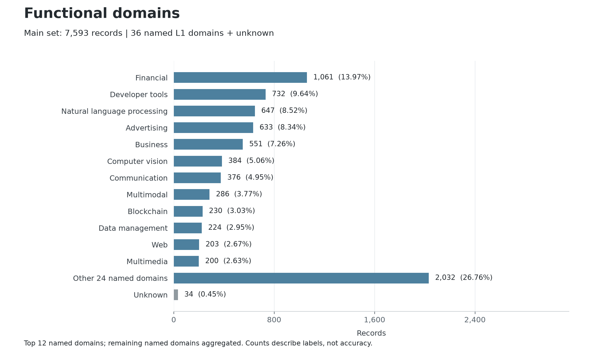
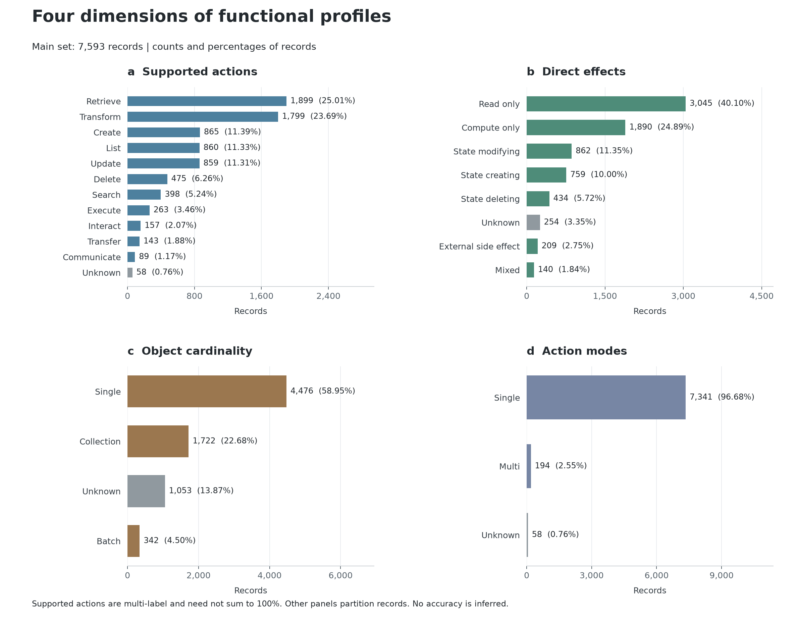

# UTSR-ToolMeta Dataset

**Current version: v0.2.** UTSR-ToolMeta represents heterogeneous LLM-agent tool declarations in a Unified Tool Semantic Representation (UTSR). This README is the single documentation entry point for the dataset, functional fields, statistics, usage, limitations, and data-use terms.

## Dataset and Sources

| File | Records | Description |
|---|---:|---|
| [release_valid](releases/v0.2/data/utsr_records.release_valid.jsonl) | 7,593 | Full valid declaration dataset. |
| [high_confidence](releases/v0.2/data/utsr_records.high_confidence.jsonl) | 4,408 | Inherited declaration-quality subset, not a human-gold annotation subset. |
| [core_balanced](releases/v0.2/data/utsr_records.core_balanced.jsonl) | 2,000 | Source-balanced subset with 400 records per source family. |

Subsets overlap. Do not concatenate them as independent samples. Stable IDs support joins to the main set; records with the same ID are identical across subsets. Each subset retains its own ordering. Duplicate declarations are not deleted, and declaration similarity does not establish identical executable backends.

<!-- source-statistics:start -->
| Source family | Records | Share |
|---|---:|---:|
| MCP | 3,145 | 41.42% |
| OpenAPI | 1,909 | 25.14% |
| Tool benchmarks | 1,364 | 17.96% |
| Function-calling datasets | 741 | 9.76% |
| Framework tools | 434 | 5.72% |
<!-- source-statistics:end -->

MCP sources include server and catalog declarations. OpenAPI entries are operation-level descriptions, not necessarily installed tools. Framework entries describe integrated tools; benchmark and function-calling entries are research declarations. Source URLs, versions, and license metadata are retained where available. Raw source snapshots and implementation code are not bundled.

## Record Format

Each JSONL line is one record. Use the [public record schema](releases/v0.2/schema/utsr_record.schema.json) and [functional-profile schema](releases/v0.2/schema/function_profile.schema.json) for validation.

| Field | Meaning |
|---|---|
| `record_id` | Stable record identifier. |
| `dataset_meta` | Original dataset name, creation date, language, split, schema metadata, and source UID. |
| `source_meta` | Upstream source family, ID, URL, version, license, framework, and collection metadata. |
| `function_profile` | Ten-field derived functional classification, described below. |
| `utsr.source` | Framework, upstream type/channel, and usage context. |
| `utsr.identity` | Tool name and optional namespace. |
| `utsr.capability` | Primary capability description, optional summary, and return description. |
| `utsr.interface` | Input schema, flat parameters, output schema, and output type. |
| `utsr.binding` | Executor reference, serializer target, and raw descriptor reference. |
| `provenance.raw_descriptor_ref` | Source descriptor reference; the raw files are not included. |

`input_schema` is the authoritative structured interface when trustworthy. Flat `parameters` support compatibility and source inspection, not an equivalent second invocation schema. Parameter names, types, requiredness, descriptions, defaults, and enums are preserved, including existing primitive/null unions. Missing optional information remains null or empty. A non-null schema or binding is not proof of executable compatibility or authorization to access a service.

Original per-record schema-version metadata is preserved for traceability. Package [VERSION.json](releases/v0.2/VERSION.json) identifies the current public distribution. Construction-only traces and internal review assets are omitted; normalized tool semantics and functional labels are retained.

## Functional Profiles

The profile answers four practical questions: **what domain does this tool serve, what does the current call do, what effect does it have, and how many logical objects does it handle?** It also represents the object and task intent. These dimensions are separate: a tool can create an intermediate object entirely in memory without changing persistent state.

### The Ten Fields

| Field | Type | What it describes |
|---|---|---|
| `primary_domain` | string | Main domain from the frozen 37-value L1 vocabulary, including `unknown`. |
| `primary_subdomain` | string or null | Fine-grained lower-snake-case descriptor, not a closed taxonomy. |
| `secondary_domains` | array of strings | Additional supported domains; unique, without `unknown` or the primary domain. |
| `supported_actions` | array of strings | Nonempty unique set of actions directly performed by the current call. `unknown` appears only alone. |
| `primary_action` | string or null | Main supported action when evidence establishes one; otherwise null. |
| `action_mode` | string | `single`, `multi`, or `unknown`: number of supported action classes, not number of objects. |
| `effect_class` | string | Direct effect: reading, computation, state creation/modification/deletion, external side effect, mixed, or unknown. |
| `resource_object` | string or null | Logical object acted upon or produced. |
| `cardinality` | string | `single`, `collection`, `batch`, or `unknown`: object-level granularity of one call. |
| `task_intent` | object | Structured `actions`, `object`, `qualifiers`, and nullable `canonical_text`. Actions/object match the profile. |

The action vocabulary has eleven named classes plus `unknown`: `search`, `list`, `retrieve`, `create`, `update`, `delete`, `execute`, `transform`, `communicate`, `transfer`, `interact`, and `unknown`.

`single` means one logical object; `collection` means a collection-oriented operation; `batch` means explicitly multiple independently handled inputs or objects. One action class may process a batch. A multi-action tool may still act on one object. Unknown values in these dimensions are independent.

### Example

The following is an illustrative profile, not an additional dataset record:

```json
{
  "primary_domain": "file_system",
  "primary_subdomain": "file_reading",
  "secondary_domains": [],
  "supported_actions": ["retrieve"],
  "primary_action": "retrieve",
  "action_mode": "single",
  "effect_class": "read_only",
  "resource_object": "file",
  "cardinality": "single",
  "task_intent": {
    "actions": ["retrieve"],
    "object": "file",
    "qualifiers": [],
    "canonical_text": "retrieve file"
  }
}
```

Direct action is not downstream use of the result. Creating unsigned transaction steps is not transferring funds; returning a draft is not sending it. Conversely, a call that actually submits or sends has a real direct effect. Functional labels describe the available declaration evidence, not a verified implementation.

### Distribution

All charts and percentages below use the **7,593-record main set**, not the sum of overlapping subsets. These are descriptive dataset counts, not accuracy estimates, evaluation results, or uncertainty intervals.



The domain chart shows the twelve largest named domains, aggregates the other named domains, and displays `unknown` separately. Complete counts are available in [the domain CSV](stats/v0.2/primary_domain_distribution.csv).



Supported actions are **multi-label**: one record may contribute to more than one action. Their percentages use 7,593 records as denominator and must not be added as a partition. Domain, effect, cardinality, and mode each have one value per record. [Primary-action counts](stats/v0.2/primary_action_distribution.csv) are separate; `__null__` is a summary-file bucket, while records store JSON null.

<!-- functional-statistics:start -->
#### Evidence Availability

| Dimension | Known labels | Unknown labels |
|---|---:|---:|
| Domain | 7,559 (99.55%) | 34 (0.45%) |
| Action mode | 7,535 (99.24%) | 58 (0.76%) |
| Direct effect | 7,339 (96.65%) | 254 (3.35%) |
| Cardinality | 6,540 (86.13%) | 1,053 (13.87%) |

A known label means the annotation is not `unknown`; it does not establish correctness.

#### Supported Actions (Multi-label)

| Category | Records | Share of main set |
|---|---:|---:|
| `retrieve` | 1,899 | 25.01% |
| `transform` | 1,799 | 23.69% |
| `create` | 865 | 11.39% |
| `list` | 860 | 11.33% |
| `update` | 859 | 11.31% |
| `delete` | 475 | 6.26% |
| `search` | 398 | 5.24% |
| `execute` | 263 | 3.46% |
| `interact` | 157 | 2.07% |
| `transfer` | 143 | 1.88% |
| `communicate` | 89 | 1.17% |
| `unknown` | 58 | 0.76% |

#### Direct Effects

| Category | Records | Share of main set |
|---|---:|---:|
| `read_only` | 3,045 | 40.10% |
| `compute_only` | 1,890 | 24.89% |
| `state_modifying` | 862 | 11.35% |
| `state_creating` | 759 | 10.00% |
| `state_deleting` | 434 | 5.72% |
| `unknown` | 254 | 3.35% |
| `external_side_effect` | 209 | 2.75% |
| `mixed` | 140 | 1.84% |

#### Object Cardinality

| Category | Records | Share of main set |
|---|---:|---:|
| `single` | 4,476 | 58.95% |
| `collection` | 1,722 | 22.68% |
| `unknown` | 1,053 | 13.87% |
| `batch` | 342 | 4.50% |

#### Action Modes

| Category | Records | Share of main set |
|---|---:|---:|
| `single` | 7,341 | 96.68% |
| `multi` | 194 | 2.55% |
| `unknown` | 58 | 0.76% |
<!-- functional-statistics:end -->

The complete [statistics JSON](stats/v0.2/dataset_statistics.json) and [CSV tables](stats/v0.2/) support further analysis. Subdomains are descriptive labels rather than a calibrated closed vocabulary; their variety is not a measure of annotation quality.

### Annotation and Interpretation

Functional profiles are derived labels produced with rule-based pre-annotation and per-record AI-assisted semantic review, including conflict review. AI participation is declared here at dataset level; no model, confidence, evidence, or review-status fields are added to released profiles. Labels are not human gold or measured tool-execution behavior. `unknown` means insufficient declaration evidence, not withheld labels. Sixteen known parsing-gap records retain abstaining profiles.

Profiles are for analysis and must not be passed to evaluated agents as tool-owned declarations. Independently verify the behavior of selected tools before execution experiments. Declaration-quality subset names do not imply profile accuracy.

## Usage

Python 3.10 or newer is required. Reading, statistics, and hash verification use the standard library. Full schema validation requires `jsonschema`; optional chart regeneration requires `matplotlib`.

```bash
pip install -r requirements.txt
python examples/read_dataset.py releases/v0.2/data/utsr_records.core_balanced.jsonl --limit 3
python scripts/verify_release.py releases/v0.2
python scripts/validate_schema.py releases/v0.2/data/utsr_records.release_valid.jsonl
python scripts/summarize_dataset.py releases/v0.2/data/utsr_records.release_valid.jsonl --out stats/v0.2
python -B -m unittest discover -s tests
```

To regenerate the README charts and statistical tables from the published statistics:

```bash
pip install matplotlib
python scripts/plot_profile_statistics.py
```

The version-local [MANIFEST.sha256](releases/v0.2/MANIFEST.sha256) binds the data, schemas, version, and package statistics. Repository-level documentation, charts, and utilities may be revised without changing dataset records.

## Repository Layout

```text
README.md             All dataset documentation and data-use terms.
LICENSE               Code and documentation license.
CITATION.cff          Dataset citation metadata.
releases/v0.2/data/    Current JSONL subsets.
releases/v0.2/schema/  Record and functional-profile schemas.
releases/v0.2/         Package version, statistics, and integrity manifest.
stats/v0.2/           Full analysis statistics and CSV distributions.
assets/               README statistical charts.
scripts/              Public validation, statistics, and plotting utilities.
examples/             Minimal reading example.
tests/                Public utility tests.
```

Private work files, raw source snapshots, internal reviews, construction traces, attack algorithms, and experiment configurations are not distributed. Previous repository versions remain in Git history.

## Limitations and Responsible Use

Some records are API or benchmark descriptions rather than directly executable installed tools. Input/output specifications and source metadata can be incomplete. Schema validation checks record shape, not every embedded protocol schema, functional label, backend safety, or execution behavior.

The distribution contains no private conversations, service credentials, runtime execution traces, or backend implementation code. Upstream illustrative values may remain in declarations and are not usable access credentials. Binding references do not provide executable access to services.

Use only in authorized controlled research environments. Do not deploy metadata perturbations against real registries or production agents without authorization, infer private behavior, or imply upstream endorsement. Preserve source attribution and report real vulnerabilities responsibly. Request corrections or removals by opening an issue with the record ID and source information.

## Citation and Data-Use Terms

Cite this repository and specify version v0.2; [CITATION.cff](CITATION.cff) provides the metadata. No accompanying paper citation or archival DOI is claimed yet.

Scripts and documentation are covered by [LICENSE](LICENSE). Upstream providers retain rights to source-derived tool names, descriptions, schemas, URLs, and other metadata. **No blanket license is asserted over upstream-derived records.** Use and redistribution remain subject to applicable source licenses and terms. Missing or unknown license metadata is not unrestricted permission.

Retain source metadata and attribution when reusing records, cite the dataset and accompanying paper when available, do not imply endorsement, and do not use it to attack third-party systems. A paper-linked archival release still requires source-specific license review under the final venue and institution requirements.
